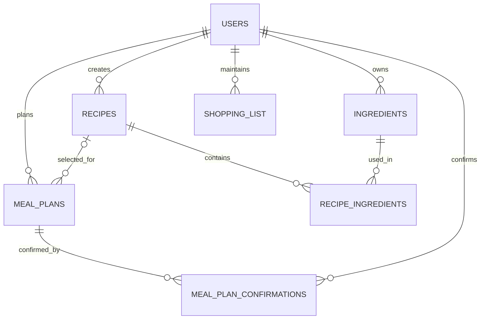

# SQL ER diagram

```mermaid
erDiagram
  USERS ||--o{ RECIPES : creates
  USERS ||--o{ INGREDIENTS : owns
  USERS ||--o{ MEAL_PLANS : plans
  USERS ||--o{ SHOPPING_LIST : maintains
  RECIPES ||--o{ RECIPE_INGREDIENTS : contains
  INGREDIENTS ||--o{ RECIPE_INGREDIENTS : used_in
  RECIPES o|--o{ MEAL_PLANS : selected_for
  MEAL_PLANS ||--o{ MEAL_PLAN_CONFIRMATIONS : confirmed_by
  USERS ||--o{ MEAL_PLAN_CONFIRMATIONS : confirms
```
